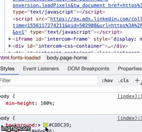

## Plan for the day

- [x] Continue watching - [Mastering Chrome Developer Tools, v2](https://frontendmasters.com/courses/chrome-dev-tools-v2/) by Jon Kuperman.

## Learned today

- You can use Chrome DevTools as **IDE** (`<insert screaming face emoji here>`)!!
- Pressing `escape` key on any tab (except console) opens "Console drawer".

### "Elements" tab

- Press `opt / alt` key and click the expand arrow of any DOM node to expand all the children nodes.
- Right-click on a node and pick "Scroll into view" to move focus into that element -- especially helpful for infinite scroll websites.
- In CSS editor, clicking on any color swatch opens color panel. Click on the 2nd set of arrows opens color palette, from where you can pick some pre-defined nice palettes (e.g. *Material Design*) or custom palette based on current colors of the website. Long-click on any color opens up options with multiple shades.

  

- You can click on a node and press `h` to hide the element. (it behaves like `visibility: hidden`, i.e. keeps space in DOM). Pressing `delete` key removes the element completely from DOM.
  - Having a specific selector on that element with `visibility: visible !important` overrides the `h` shortcut.

- You can trigger various states of element, e.g. `hover`. With an element highlighted, click on `:hov` button where you can simulate element state.

## Resources list

- [Chrome DevTools official documentation](https://developers.google.com/web/tools/chrome-devtools/)

## Other resources
