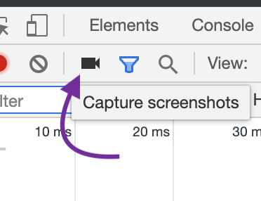

## Plan for the day

- [x] Continue watching - [Mastering Chrome Developer Tools, v2](https://frontendmasters.com/courses/chrome-dev-tools-v2/) by Jon Kuperman.

## Learned today

### "Network" tab

It can help answer questions similar to *"Why are the requests so slow?"*:

- Is it because they are too big?
- Are we asking for too many?
- Is it a server problem?
- Is it possible we're trying to fetch from two different sources?

- X axis is always time, each bar is an item.
- Bottom part of the tab shows detailed information about each fetched resource (usually) in order of being described in `<head>` tag. First item to be loaded is HTML which gets parsed and analyzed for calls to other resources (images, CSS, scripts, etc/).
  - Browser will try to assess priority of each resource and reduce or increase it (e.g. de-prioritizing image files over CSS).
- *Initiator* tab shows source of the network call.
  - Hold *SHIFT* and hover over an item to see different background colors. Green shows the file where it's been downloaded from; red shows what it has called.
- *Size* will sometimes show two values: actual size and compressed / cached.

### Color codes

- White: queuing (put on hold as max 6 requests at the same time are allowed or de-prioritized; that's why file bundling is **so important**).
- Grey: stalled / blocking.
- Light grey: proxy negotiation.
- Green: DNS lookup (it's cached for multiple requests to the same resource).
- Orange: initial connection / connecting (including TCP handshakes / retries and negotiating SSL).
- Brown: completing SSL handshake.
- Light green: request sent / sending.
- Light green: waiting (time to first byte).
- Blue: content download / downloading.

### Screenshots tool

If active, it will show every repaint and what the page looked like at that state in time.

## Resources list

## Other resources
