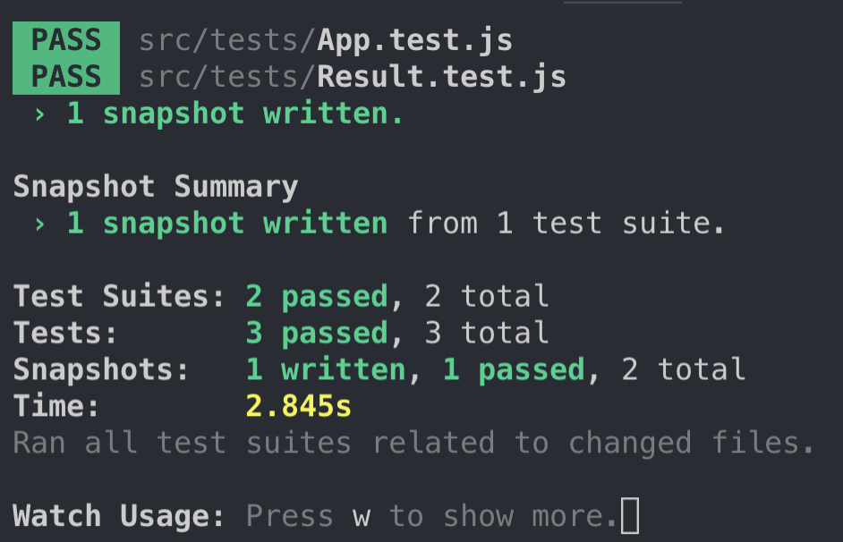

## Plan for the day

- [x] Reanimate tests in my React calc app.
- [ ] Cover UI with tests (*in progress*)!
- [x] Finish watching - [Mastering Chrome Developer Tools, v2](https://frontendmasters.com/courses/chrome-dev-tools-v2/) by Jon Kuperman.

## Learned today

- It was easier to create a new `create-react-app` project from scratch than to figure out what to add to have running tests (note to self: don't try to be smart with "I'll add it later by myself" attitude and just keep stuff you know you will need later like, you know, tests!). I kept my components and styling. It was as easy as copying few files and re-installing some dependencies.
- Even though I work with React almost on a daily basis, I've never set up tests by myself. It's really interesting to see how it works from scratch!

### Snapshot testing

Testing React involves UI which should stay stable and not change unexpetedly. Snapshot tests render a component and compare its state with a reference snapshot stored with the test.

**Jest** allows you to render and test separate components, without the need to build and render the whole app UI.

- I got my first tests running!!

  

  Now I *only* need to figure out how exactly Jest knows when tests are okay, but it's the snapshot what should be updated...

### [Chrome DevTools] Page Jank

It's jittering / jumping happening on websites, where a smooth scrolling would be expected. Obviously a bug.

Possible reasons:

- JS being too heavy

  Smooth scrolling is defined at 60 frames / s, as the refresh rate on most devices nowadays. The browser needs to come up with a new picture (frame) for each of those refreshes. If it fails (because for example, it's busy trying to process bloated JS), we do not see smooth animation anymore.

- Page trashing

  Constantly modifying DOM (reading / writing) triggers the browser to keep refreshing the layout. Ideally instead of doing it in multiple read / write cycles, it's better to group similar actions together in batches for fewer layout refreshes. This, however, is rarely achievable.

  Solutions:

  - `window.requestAnimationFrame()` asks the browser to do some computation before next frame,
  - `FastDOM` library provides callbacks on read and write.

### [Chrome DevTools] Memory

Garbage collector removes objects which are flagged as unused and no longer referenced. Sometimes though it is not possible to apply the flag (memory keeps being used) and this might be the cause of memory leaks.

Possible reasons:

- global variables (are you sure it has to be a global?),
- forgotten timers and intervals,
- variables which hold references to DOM objects which no longer exist (e.g. were deleted),

- *Performance* tab in DevTools helps you detect memory leaks while *Memory* tab shows you the exact reason(s).
- When recording a performance session for memory, you'd want to make it slightly **longer** (to build up memory consumption data) than in case of CPU performance tests.

#### Task manager in Chrome

- Accessible via *Three dots menu* > *More tools* > *Task manager*
- Monitors performance of each Chrome tab
- Right-click on column names to access more data, e.g. *JavaScript memory*

#### Memory profiles

- Heap snapshot: shows everything that's being used. Can be run multiple times to get results to be compared.
- Allocation instrumentation on timeline: like multimple heap snapshots, takes a lot of time.
- Allocation sampling: takes different samples over long period of time.

**Shallow size**: how big are you?
Example: an array with 50 elements

**Retained size**: how big are elements you're pointing at (how much memory can we free up if we get rid of you)?
Example: a variable pointing to an array with 1m elements

Aaaand that's how I have finished the "Mastering Chrome developer tools" class! Time for more!

## Resources list

- [Jest docs](https://jestjs.io/docs/en/tutorial-react)
- [Jest snapshot testing](https://jestjs.io/docs/en/snapshot-testing)
- [JS startup performance](https://medium.com/reloading/javascript-start-up-performance-69200f43b201)

## Other resources